# Prism themes

This repository lists a selection of additional themes for the [Prism syntax highlighting library](http://prismjs.com/).

## How to use a theme

To use one of the themes, just include the theme's CSS file in your page. Example:

```html
<!DOCTYPE html>
<html>
    <head>
        ...
        <link href="themes/prism-ghcolors.css" rel="stylesheet" />
    </head>
    <body>
        ...
        <script src="prism.js"></script>
    </body>
</html>
```

## Available themes

* [__CB__](themes/prism-cb.css) (originally by [C. Bavota](https://bitbucket.org/cbavota), adapted by [atelierbram](https://github.com/atelierbram))<br />
[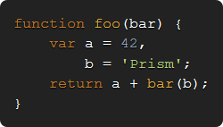](themes/prism-cb.css)

* [__GHColors__](themes/prism-ghcolors.css) (by [aviaryan](https://github.com/aviaryan))<br />
[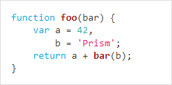](themes/prism-ghcolors.css)

* [__Pojoaque__](themes/prism-pojoaque.css) (originally by [Jason Tate](http://web-cms-designs.com/ftopict-10-pojoaque-style-for-highlight-js-code-highlighter.html), adapted by [atelierbram](https://github.com/atelierbram))<br />
[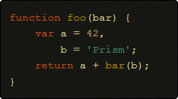](themes/prism-pojoaque.css)

* [__Xonokai__](themes/prism-xonokai.css) (originally by [Maxime Thirouin (MoOx)](https://github.com/MoOx), adapted by [atelierbram](https://github.com/atelierbram))<br />
[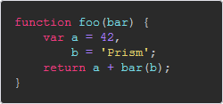](themes/prism-xonokai.css)

* [__Ateliersulphurpool-light__](themes/prism-base16-ateliersulphurpool.light.css) (by [Bram de Haan](https://github.com/atelierbram))<br />
[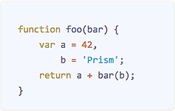](themes/prism-base16-ateliersulphurpool.light.css)

* [__Hopscotch__](themes/prism-hopscotch.css) (by [Jan T. Sott](https://github.com/idleberg))<br />
[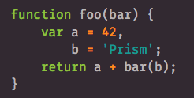](themes/prism-hopscotch.css)

* [__Atom Dark__](themes/prism-atom-dark.css) (by [gibsjose](https://github.com/gibsjose), based on [Atom Dark Syntax theme](https://github.com/atom/atom-dark-syntax))<br />
[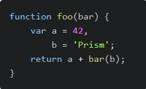](themes/prism-atom-dark.css)

* [__Duotone Dark__](themes/prism-duotone-dark.css) (by [Simurai](https://github.com/simurai), based on [Duotone Dark Syntax theme for Atom](https://github.com/simurai/duotone-dark-syntax))<br />
[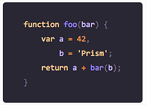](themes/prism-duotone-dark.css)

* [__Duotone Sea__](themes/prism-duotone-sea.css) (by [Simurai](https://github.com/simurai), based on [DuoTone Dark Sea Syntax theme for Atom](https://github.com/simurai/duotone-dark-sea-syntax))<br />
[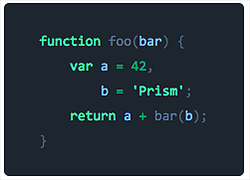](themes/prism-duotone-sea.css)

* [__Duotone Space__](themes/prism-duotone-space.css) (by [Simurai](https://github.com/simurai), based on [DuoTone Dark Space Syntax theme for Atom](https://github.com/simurai/duotone-dark-space-syntax))<br />
[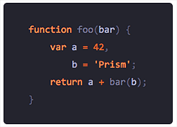](themes/prism-duotone-space.css)

* [__Duotone Earth__](themes/prism-duotone-earth.css) (by [Simurai](https://github.com/simurai), based on [DuoTone Dark Earth Syntax theme for Atom](https://github.com/simurai/duotone-dark-earth-syntax))<br />
[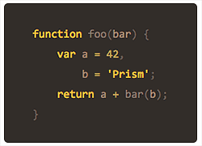](themes/prism-duotone-earth.css)

* [__Duotone Forest__](themes/prism-duotone-forest.css) (by [Simurai](https://github.com/simurai), based on [DuoTone Dark Forest Syntax theme for Atom](https://github.com/simurai/duotone-dark-forest-syntax))<br />
[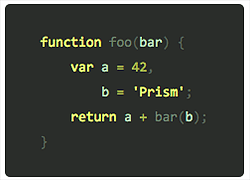](themes/prism-duotone-forest.css)

* [__Duotone Light__](themes/prism-duotone-light.css) (by [Simurai](https://github.com/simurai), based on [DuoTone Light Syntax theme](https://github.com/simurai/duotone-light-syntax))<br />
[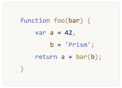](themes/prism-duotone-light.css)

* [__VS__](themes/prism-vs.css) (by [andrewlock](https://github.com/andrewlock))<br />
[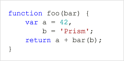](themes/prism-vs.css)

* [__Darcula__](themes/prism-darcula.css) (by [service-paradis](https://github.com/service-paradis), based on Jetbrains Darcula theme)<br />
[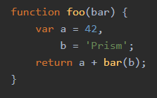](themes/prism-darcula.css)
